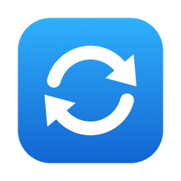
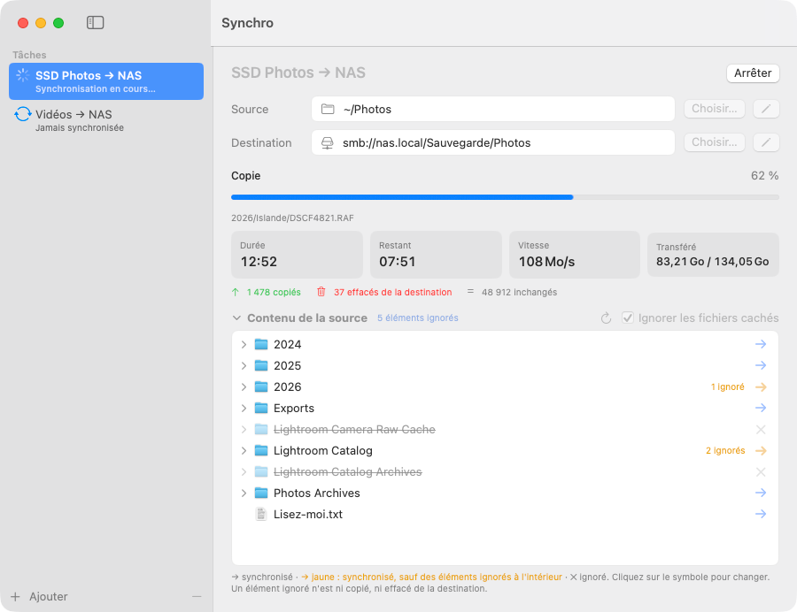
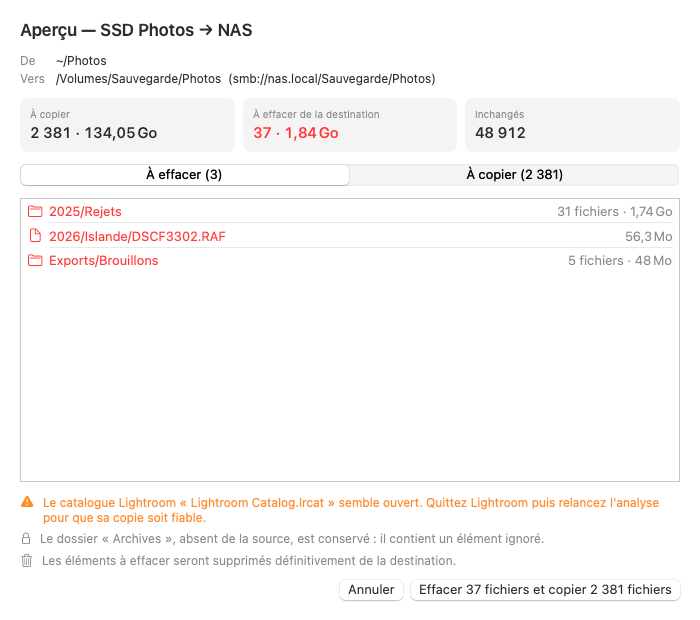
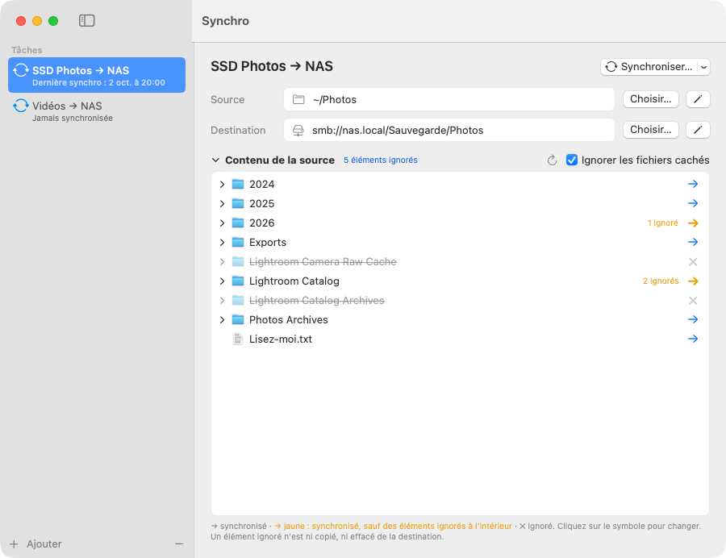

<p align="center"></p>

# Synchro

Application macOS native (SwiftUI) qui fait un **miroir** d'un dossier ou d'un disque vers un autre emplacement — typiquement un SSD de photos vers un NAS en SMB. La destination reflète la source : mêmes dossiers, mêmes fichiers, mêmes dates. Les nouveautés sont copiées, et ce qui n'existe pas dans la source est effacé de la destination.







*Captures réalisées avec des données fictives.*

## Fonctions

- **Tâches** : chaque tâche garde sa source, sa destination et ses éléments ignorés. Ajoutez-en autant que voulu. Au premier lancement, une tâche d'exemple est proposée : remplacez sa source et sa destination par les vôtres.
- **Aperçu avant d'agir** : Synchro analyse d'abord, puis liste ce qui sera effacé (par dossier, avec le nombre de fichiers et la taille) et ce qui sera copié. Rien n'est modifié sans confirmation.
- **Suivi en direct** : étape en cours, durée, temps restant, vitesse de transfert, volume transféré, nombre de fichiers copiés, effacés, inchangés et en échec.
- **Éléments ignorés** : dans l'arborescence de la source, cliquez sur la flèche → d'un dossier ou d'un fichier pour la changer en ✕. Un élément ignoré n'est ni copié, ni effacé de la destination, même si son dossier parent disparaît de la source. Un dossier qui reste synchronisé mais contient des éléments ignorés porte une flèche jaune et leur nombre. Le lien « N éléments ignorés » en donne la liste complète.
- **Fichiers cachés** ignorés (désactivable par tâche). Les fichiers système (`.DS_Store`, `.Spotlight-V100`, `.Trashes`, `._*`…) ne sont jamais copiés.
- **Destination SMB** : `smb://serveur/partage/dossier`. Le partage est connecté au besoin ; le mot de passe vient du Trousseau macOS et n'est jamais stocké par l'app.
- **Glisser-déposer** d'un dossier ou d'un alias sur les lignes Source et Destination.
- **Modifications confirmées** : les changements d'une tâche ne sont gardés qu'après « Enregistrer », et l'app avertit si vous quittez sans l'avoir fait.
- **Notification et son** à la fin de la synchronisation, et quand une analyse longue ou faite en arrière-plan attend votre confirmation.
- **Journal** : chaque synchronisation laisse un fichier texte avec le plan complet (tout ce qui devait être copié ou effacé), le résultat et les erreurs ; si elle a été interrompue, il précise ce qui a réellement été fait (menu Fichier → Afficher les journaux). Une tentative qui s'est mal terminée reste signalée dans la liste des tâches jusqu'à la prochaine réussite.
- **Comparaison du contenu à la demande** : la flèche du bouton « Synchroniser… » propose de comparer aussi le contenu de tous les fichiers qui paraissent inchangés. C'est lent, mais c'est le moyen de vérifier une sauvegarde de fond en comble.

## Garde-fous

Une synchronisation en miroir efface des fichiers : Synchro refuse ou fait confirmer les situations qui ressemblent à une erreur.

- **Dossiers imbriqués** : une destination qui contient la source (ou l'inverse) est refusée.
- **Volume absent** : une source ou une destination située sur un disque qui n'est pas connecté est refusée.
- **Source vide** : si la source ne contient aucun fichier, toute suppression est bloquée.
- **Suppression inhabituelle** : si plus du quart de la destination doit être effacé (à partir de 10 fichiers), ou si rien dans la destination ne correspond à la source, une case à cocher supplémentaire est exigée.
- **Autre volume** : si la destination ne se trouve plus sur le même disque ou le même partage qu'à la dernière synchronisation, la même case à cocher est exigée.
- **Disque débranché ou remplacé** entre l'aperçu et l'exécution, ou en cours de route : la synchronisation s'arrête sans rien effacer de plus.
- **Aperçu périmé** : un aperçu laissé ouvert plus de 30 minutes doit être refait, car la destination a pu changer entre-temps.
- **Destination pleine ou en lecture seule** : arrêt immédiat avec un message clair, plutôt que des milliers d'erreurs. L'aperçu signale à l'avance un espace libre insuffisant.
- **Catalogue Lightroom ouvert** : l'aperçu le signale, car une copie prise pendant que Lightroom écrit peut être inutilisable.
- **Dossier illisible** : l'analyse s'arrête au lieu de le croire vide, ce qui ferait effacer sa sauvegarde.
- **Conflits** : un fichier qui ne peut pas être copié sans écraser autre chose (deux noms qui ne diffèrent que par les majuscules, un lien symbolique du même nom sur la destination…) est laissé de côté et signalé.

## Comment ça marche

- Un fichier est recopié si sa taille ou sa date de modification diffère (tolérance de 2 s pour les horodatages SMB et exFAT).
- Même nom, même taille et même date ne prouvent pas le même contenu : des rafales renumérotées après un tri donnent exactement cela. Synchro compare donc aussi le contenu (cinq échantillons répartis dans le fichier) dans trois cas :
  - le fichier a été touché depuis la dernière synchronisation réussie — réécrit sur place, renommé, échangé avec un autre. Le système note ce changement même si la date de modification a été remise comme avant ;
  - il se trouve dans un dossier où un fichier vient d'être ajouté, remplacé ou retiré, et il est ambigu : date pas rigoureusement identique, ou voisin de même taille à moins de 2 s ;
  - une différence trouvée dans son dossier n'a pas pu être réparée lors d'une synchronisation précédente (copie en échec, arrêt, coupure).

  Dès qu'une différence est prouvée, tout le dossier est comparé.
- Limites de cette comparaison : le premier cas suppose une synchronisation déjà réussie avec cette version et une source en APFS ou Mac OS étendu (un disque exFAT ne note pas ces changements) ; et comme seuls des échantillons sont lus, une retouche limitée à une petite zone d'un gros fichier, faite sans changer sa taille ni sa date, peut passer inaperçue. La comparaison complète à la demande couvre le reste.
- Chaque fichier est écrit sous un nom temporaire caché, sa taille est contrôlée, puis il remplace l'ancien : une copie interrompue ne laisse pas de fichier tronqué sous son vrai nom, et l'ancienne version reste en place tant que la nouvelle n'est pas complète. Un reste temporaire éventuel est retiré à la synchronisation suivante.
- Un fichier modifié pendant sa copie est signalé et recopié à la synchronisation suivante.
- Les dates sont posées une fois le fichier en place, puis contrôlées à la fin de la synchronisation : un NAS réécrit volontiers la date d'un fichier qu'il vient de recevoir, et sans cela le même fichier serait recopié à chaque fois.
- Sont conservés : la date de modification, la date de création et, quand le serveur l'accepte, les étiquettes, couleurs et commentaires du Finder des fichiers.
- Ne sont pas recopiés : les permissions, les liens symboliques et autres fichiers spéciaux, les dates et étiquettes des dossiers, et les fichiers cachés (sauf si l'option est décochée). Un changement d'étiquette seul, sans modification du fichier, n'est pas détecté.
- Les noms accentués sont comparés sous forme Unicode normalisée, pour qu'un « é » du Mac et un « é » du NAS soient reconnus comme identiques.
- Si seules les majuscules d'un nom changent (« Islande » devient « islande »), l'élément est renommé sur la destination sans être recopié. Tout autre renommage ou déplacement d'un dossier le fait effacer puis recopier en entier.
- Quand un dossier disparaît de la source, les fichiers cachés qu'il contenait sur la destination disparaissent avec lui ; seuls les éléments que vous avez marqués ✕ le font conserver.
- Les fichiers de service de Windows et des NAS (`Thumbs.db`, `desktop.ini`, `$RECYCLE.BIN`, `@eaDir`…) ne sont ni copiés ni effacés, comme les fichiers système de macOS ; un élément masqué qui n'existe que sur la destination est laissé en place.
- Le Mac ne se met pas en veille pendant l'analyse ni pendant la copie.

## Installer

Il faut macOS 14 ou plus récent. L'app est compilée pour Apple Silicon et Intel ; elle n'a été essayée que sur macOS 27 avec Apple Silicon.

1. Téléchargez **[Synchro.dmg](https://github.com/mdany75/Synchro/releases/latest/download/Synchro.dmg)**.
2. Ouvrez-le et glissez **Synchro** sur le dossier **Applications**.
3. Lancez Synchro, puis suivez la section « Autorisations » ci-dessous : le premier lancement est bloqué par macOS.

## Utilisation

1. Cliquez sur **Ajouter**, nommez la tâche, puis choisissez la source et la destination (bouton « Choisir… », glisser-déposer, ou crayon pour saisir une adresse `smb://`).
2. Dans « Contenu de la source », marquez d'un ✕ ce qui ne doit pas être sauvegardé, puis cliquez sur **Enregistrer**.
3. Cliquez sur **Synchroniser…** : l'analyse commence, rien n'est encore modifié.
4. Lisez l'aperçu, en particulier la liste « À effacer », puis confirmez. S'il n'y a rien à faire, Synchro l'indique directement dans la fenêtre.
5. À la fin, le résultat s'affiche et un journal est enregistré.

Choisissez comme destination un **dossier réservé à ce miroir** : tout ce qui s'y trouve et n'existe pas dans la source sera effacé.

## Autorisations

### Premier lancement : « Ouvrir quand même »

Synchro n'est pas signée avec un certificat Apple payant. Au premier lancement, macOS affiche donc un message du type « Apple n'a pas pu vérifier que Synchro ne contient pas de logiciel malveillant ». Pour l'autoriser :

1. Cliquez sur **Terminé** dans le message (pas sur « Placer dans la corbeille »).
2. Ouvrez **Réglages Système → Confidentialité et sécurité**.
3. Descendez jusqu'à la section **Sécurité** : une ligne indique que Synchro a été bloquée. Cliquez sur **Ouvrir quand même**.
4. Confirmez avec votre mot de passe ou Touch ID, puis **Ouvrir**.

Autre méthode, dans le Terminal :

```bash
xattr -dr com.apple.quarantine /Applications/Synchro.app
```

### Accès aux disques et au réseau

À la première utilisation, macOS demande d'autoriser Synchro à accéder aux **volumes amovibles** (le SSD) et aux **volumes réseau** (le NAS). Cliquez sur **Autoriser**. Une demande semblable apparaît si une tâche vise le Bureau, Documents ou Téléchargements.

Si vous avez refusé par erreur, la liste de la source affiche « Accès refusé par macOS ». Pour corriger : **Réglages Système → Confidentialité et sécurité → Fichiers et dossiers → Synchro**, puis activez « Volumes amovibles » et « Volumes réseau ».

### Notifications

Au premier lancement d'une analyse, macOS demande d'autoriser les notifications. Pour changer d'avis plus tard : **Réglages Système → Notifications → Synchro**. Sans cette autorisation, seul le son est joué.

### Mot de passe du NAS

Synchro ne demande ni ne stocke le mot de passe. Connectez le partage une fois dans le Finder (**Aller → Se connecter au serveur…**, ⌘K) en cochant **Conserver ce mot de passe dans mon trousseau** ; Synchro pourra ensuite connecter le partage toute seule.

### Après une mise à jour

Chaque nouvelle version doit être autorisée de nouveau : refaites « Ouvrir quand même » et acceptez encore les demandes d'accès aux disques. Si la liste de la source reste vide alors que les interrupteurs sont activés dans les Réglages, désactivez-les puis réactivez-les.

## Conseils

- **Quittez Lightroom** avant de synchroniser son catalogue.
- **Activez la corbeille réseau** de votre NAS (et les instantanés s'il en propose) : Synchro efface définitivement, c'est votre filet de sécurité.
- **Arrêter puis relancer** une synchronisation reprend où elle en était ; seul le fichier en cours recommence.
- Les tâches sont enregistrées dans `~/Library/Application Support/Synchro/presets.json`, les journaux dans le dossier `Journal` voisin (les 50 derniers sont gardés).

## Reconstruire

Il faut les Command Line Tools d'Apple (`xcode-select --install`). Xcode n'est pas nécessaire. Vérifié avec Swift 6.4 et le SDK macOS 27.

```bash
./build.sh
```

Lance les tests, compile l'app pour Apple Silicon et Intel, la signe (ad hoc) et produit `build/Synchro.app` et `build/Synchro.dmg`. `./build.sh --install` installe en plus l'app dans `/Applications`.

## Tests

```bash
./test.sh
```

Tests du moteur de synchronisation, puis du déroulement d'une tâche dans l'app (analyse, aperçu, exécution, état enregistré). Ils travaillent uniquement sur des dossiers temporaires du Mac : jamais sur un disque branché, un partage réseau ni vos tâches enregistrées. `./build.sh` les lance aussi.

Le binaire accepte un mode ligne de commande, pour examiner un plan sans interface :

```bash
build/Synchro.app/Contents/MacOS/Synchro --plan <source> <destination> [--exclude <chemin relatif>]…
```

Cette commande affiche le plan sans rien écrire. Avec `--run`, le plan est exécuté tout de suite, **sans aperçu ni demande de confirmation** (les suppressions sont définitives) ; `--confirmer` remplace la case à cocher exigée pour une situation inhabituelle, et `--comparer-tout` compare le contenu de tous les fichiers qui paraissent inchangés. Dans ce mode, les fichiers cachés sont toujours ignorés et aucun journal n'est écrit.

## Organisation

- `Sources/SynchroCore/` : le moteur (analyse, plan, copie, garde-fous), sans interface.
- `Sources/Synchro/` : l'app SwiftUI (fenêtre, tâches, journal, notifications) et le mode ligne de commande.
- `Tests/` : tests du moteur et du déroulement d'une tâche.
- `Resources/` : icône de l'app.
- `scripts/` : outil qui dessine l'icône.
- `docs/` : captures d'écran du README.
- `build.sh`, `test.sh` : construction et tests ; tout ce qui est produit va dans `build/`, ignoré par git.

## Avertissement

Synchro **efface définitivement** de la destination tout ce qui n'est pas dans la source. Lisez l'aperçu avant de confirmer, et gardez une autre sauvegarde de ce qui compte.
